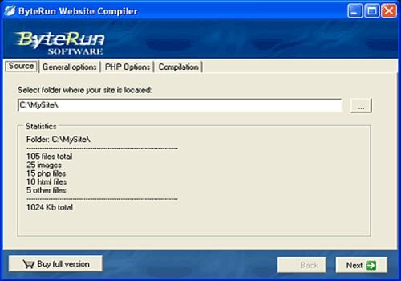

# Static Site Generation with Gatsby
#### Instructure / Engineering / Outcomes / @fmurphy

<!--
Gatsby:
What is it?
Where is it used?
Why should you want to use it?
How does it work?

After answering all these questions, I'll share my personal experience with
Gatsby.

-->

---

# Who is Gatsby?

---


<!--
The Great Gatsby is actually one of my favorite books.
Time is a central theme of the book; I'm going to try to save you some
time today.
Gatsby is going to help.
-->

---

# What is Gatsby?

---

> Can't repeat the past? ...Why of course you can!
> <cite>F. Scott Fitzgerald</cite>

---

## A New Spin on an Old Idea


<!--
contrast gatsby with jekyll / hugo:

- unified language on frontend and backend
- tooling web developers are already familiar with
-->

---

## A Static Site Generation Framework

* GraphQL
* Webpack
* React

<!--
Gatsby uses these technologies to generate static sites:

- GraphQL ingests and organizes data.
- Webpack generates and optimizes the end bundle.
- React converts data into HTML.

These probably look really familiar.

This is a large part of how Gatsby saves time: it bundles together technologies
that you probably already know.
-->

---

## A Website Compiler



<!--
Gatsby markets itself as a "website compiler". Its goal is to give developers
high-level, declarative tools to define what a site should "look like", so it
can implement more and more optimizations to make the site load faster.

This is the second way Gatsby promises to save time. Its focus is on making
blazing-fast static sites.
-->

---

## Where is it Used?

https://www.gatsbyjs.org/

<!--
Gatsby eats its own dog food. Its site has tons of great documentation and
references to the wider community.

We'll talk about the plugin ecosystem more in a bit.
-->

---

## Where is it Used?

https://reactjs.org/

<!--
React now uses it for its official site and documentation.

-->

---

## Where ... might it be used?

https://instructure.design
http://inst-eng-blog.s3-website-us-west-2.amazonaws.com/

<!--
There's lots of opportunities for using Gatsby internally. I've heard the
inst-ui team is looking into it for our ui docs. This sounds like a great idea.

I'm also currently working on porting our current engineering blog over to
Gatsby. If you're interested in that, reach out to me after this or via Slack.

-->

---
## ... Slide Decks

<!--
If you haven't figured it out by now, this entire presentation was put together
using Gatsby.

I'm a DIY guy. I decided downloading iMovie was too much trouble. How hard
could it be to just stitch together some clips via ffmpeg, I foolishly thought?
-->

---
## I Wish I Was Joking

```
ffmpeg -avoid_negative_ts make_zero -ss 00:00:01.5 -i end.mp4 -to 00:00:11 -copyinkf -c copy end2.mp4
ffmpeg -i start.mp4 -i audio.wav -c:v copy -map 0:v:0 -map 1:a:0 combined.mp4
ffmpeg -avoid_negative_ts make_zero -ss 00:00:01 -i combined.mp4 -to 00:00:40 -async 1 -strict -2 real-start.mp4
ffmpeg -loop 1 -i slide.png -c:v libx264 -t 7 -pix_fmt yuv420p -vf scale=960:720 slide.mp4
ffmpeg -i slide.mp4 -i description.wav -c:v copy -map 0:v:0 -map 1:a:0 slide-audio.mp4
ffmpeg -i slide.mp4 -i description.wav -c:v copy -map 0:v:0 -map 1:a:0 slide-audio.mp4
ffmpeg -f concat -i catlist.txt final.mp4
```

<!--
It's hard. I literally have to save my bash history every time I do this,
otherwise I'd forget it next time. I probably should use iMovie at this point,
but I'm too stubborn.
-->

---
## Gatsby Decks are Saner, I Promise!

<!--
I know it sounds crazy, and when I was editing raw HTML it really was.
But Gatsby has been a lifesaver for this stuff, even though it's bleeding edge
and has cut me from time to time.
-->

---
## Code
`iframe:https://codepen.io/anirishduck/embed/vPRwjP/?height=265&theme-id=0&default-tab=js,result`

<!--
And even code samples. You could even use codepen's live editing feature here
for UI demos. I can't because I'm too cheap to pay for their premium service,
but the sky's the limit here.

You can even do patently ridiculous things...

-->

---
## Inception
`iframe:http://localhost:8000/1`

<!--
Like embed your own slide deck inside your own slides. I was torn between a yo
dawg and Inception reference here, but let's be honest, Inception is one of my
favorite movies so it was the natural choice.
-->
